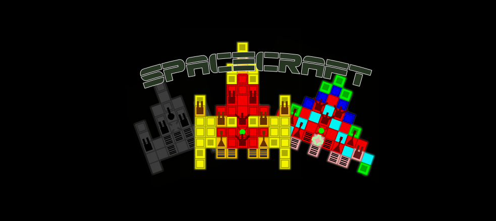
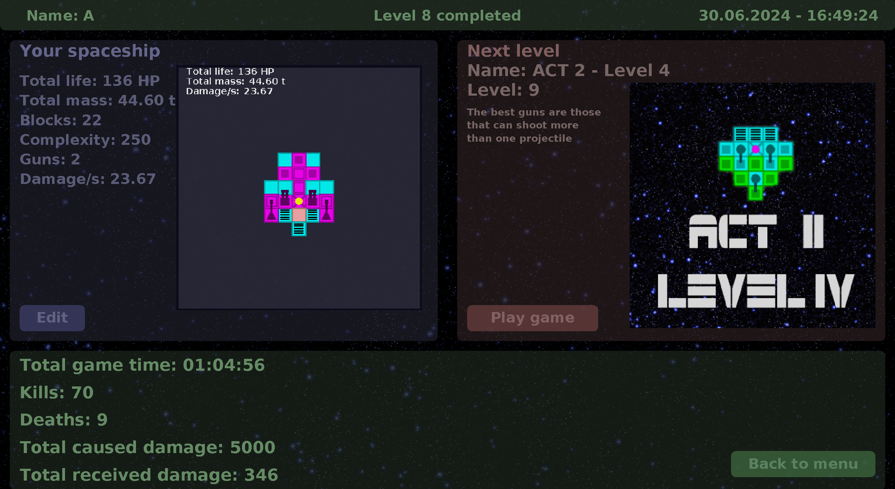
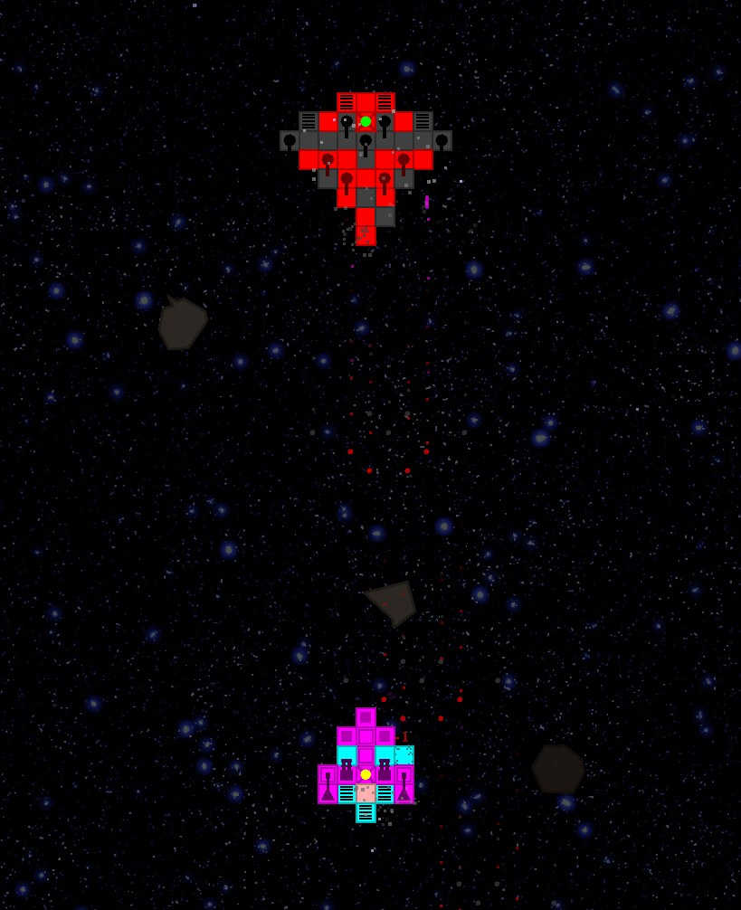
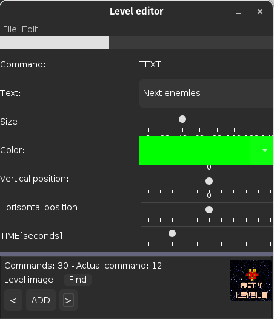
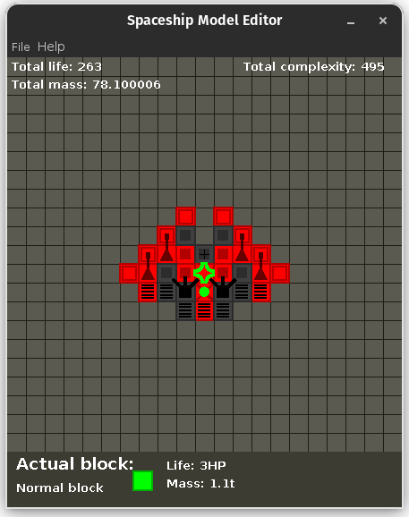

  
    
    
    

---

  <h1>BUILD & FIGHT</h1>

SpaceCraft was released in **2018**. It is a **single-player** game where players engage in combat using their own custom-built spaceships. As players progress through various levels, they earn money which can be spent on purchasing building blocks to construct and upgrade their spaceships.

Each spaceship must be equipped with essential components: weapons, propulsion systems, and a control unit. The control unit is crucial; if it is destroyed, the entire spaceship is rendered inoperable. Similarly, if all propulsion blocks are destroyed, the spaceship loses its ability to maneuver.

The game features multiple types of weapons that players can switch between and fire independently, allowing for strategic combat. Each block used in the construction of the spaceship has unique properties and varying amounts of health. When a block's health is depleted, it disintegrates, affecting the overall integrity and performance of the spaceship.

---

### Recommended Resolutions:
* 2560 x 1440
* 1920 x 1080

### Software Requirements:
* Requires Java, minimum version 17
  
## Gameplay

Before each game, players have the opportunity to modify their spacecraft models directly in the editor. This is where they can purchase new blocks and make adjustments to their design. Once players are satisfied with their modifications and feel prepared, they can enter the game with their customized spacecraft.

> **Hub menu**

  

Currently, the game features a total of 25 levels. Player's spacecraft is controlled using the mouse, with the spacecraft following the movement of the mouse cursor. Players can fire by clicking the mouse button, and switch between different weapons using keyboard keys.

> **In game**

  

## Editors

The game also offers powerful editors: a spacecraft construction editor and a level editor. Using these tools, players can create their own custom game campaigns.

**Steps to Create Your Own Game Campaign:**

1. **Create Models of Your Own Spacecraft (Enemies):** Design and build the enemy spacecraft using the construction editor.

2. **Prepare and Download a Soundtrack:** Select or create a soundtrack that will be used in specific levels.

3. **Create at Least One Level:** Use the level editor to design and build at least one level for your campaign.

4. **Save All Necessary Files in the Following Locations in the Game's Root Folder:**
   
   * **Spacecraft Models:** *models/&lt;campaign-name&gt;*
   * **Soundtracks:** *sounds/&lt;campaign-name&gt;*
   * **Levels:** *levels/&lt;campaign-name&gt;*

5. **Create new game:** Create new game, and in list select name of your new campaing.

These tools allow for extensive customization, letting players craft unique and engaging gameplay experiences.

> **Level editor on left side & Spaceship editor on right side**

  
  

